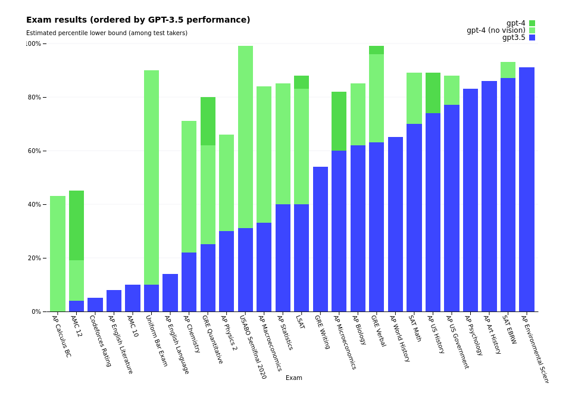
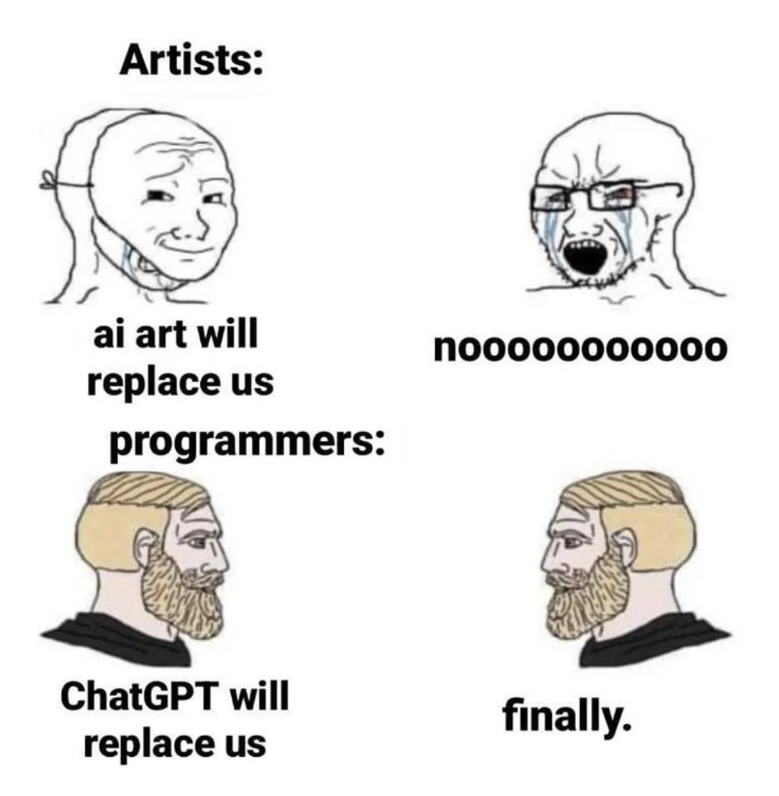

# How to Chat with GPT

[Statement on application of AI at MUNI](https://www.muni.cz/en/about-us/official-notice-board/statement-on-the-application-of-ai)

## GPT models

= generative pre-trained transformer

- GPT3, GPT3.5, [GPT4](https://openai.com/product/gpt-4) (OpenAI)

- [Codex](https://openai.com/blog/openai-codex) (OpenAI)

- [TruthGPT](https://www.reuters.com/technology/musk-says-he-will-start-truthgpt-or-maximum-truth-seeking-ai-fox-news-2023-04-17/) (Elon Musk)

- [Bard](https://bard.google.com/) (Google)

- [LlaMa](https://ai.facebook.com/blog/large-language-model-llama-meta-ai/) (Facebook, leaked)

- [Claude](https://www.anthropic.com/index/introducing-claude) (Anthropic AI)

- [GPT4ALL](https://github.com/nomic-ai/gpt4all) (NomicAI, open source)

<br>


<br>

They are trained to predict the next token (word/phrase) based on given prompt (series of previous tokens). 

The models have no underlying understanding of reality. They are statistical models of language. They just predict the most probable next token.

"Like a person with IQ 60, who spent last 10 000 years reading books... and sometimes makes up stuff."

<br>

## Training


Large Language Models based on GPTs are trained on huge numbers of text (books, Wikipedia...) or code (StackOverFlow, Github...) from the internet. However, GPT3.5 and GPT4 only have data until September 2021.

Language models are usually trained in 3 phases:

- Pre-training
- Finetuning
- Reinforcement Learning on Human Feedback (RLHF)

<br>

After the model is trained, there is still a long journey from raw language model to a chatbot. The model predicts the next token, so it needs to be chained to produce specified number of tokens (maximmally 4,096 tokens, but can output less). The model will generate series of tokens, that it finds the most probable to follow the prompt. It will also recognize when to stop (where the next token is None).

Last step is to actually tell the chatbot, using a system prompt, to provide "helpful information".

```python
import openai

openai.ChatCompletion.create(
  model="gpt-3.5-turbo",
  messages=[
        {"role": "system", "content": "You are a helpful assistant."},
        {"role": "user", "content": "When was the Hubble Space telescope launched?"}
  ]
)
```

<br>

## Keeps track of context


The model is capable of remembering the context by keeping track of previous prompts and answers.

<br>


<br>

But actually it's not that impressive if you realize that it just input's again the whole history of the conversation.

<br>

```python
import openai

openai.ChatCompletion.create(
  model="gpt-3.5-turbo",
  messages=[
        {"role": "system", "content": "You are a helpful assistant."},
        {"role": "user", "content": "When was the Hubble Space Telescope launched?"},
        {"role": "assistant", "content": "The Hubble Space Telescope was ..."},
        {"role": "user", "content": "What is the planned duration of the mission?"},
        {"role": "assistant", "content": "The original planned duration ..."},
        {"role": "user", "content": "Is this information correct?"}
  ]
)
```

<br>

## Reliability of provided answers

The provided information and facts might be innacurate, wrong or even completely made up (= hallucinating).


<br>

## Alignment problem

Using RLHF, the model is being aligned not to provide certain type of information (harmfull content, instruct how to do crime, etc.). But usually there is a way how to get around that (= alignment problem).


<br>

## Performance in various areas

[GPT4 capabilities](https://openai.com/research/gpt-4)




<br>

## Usecase of LLMs in research

#### Generating text

- explaining physical, astrophysical, statistical & other phenomena
- summarizing & explaining given text
- writing scientific papers / abstracts (not recommended)
- ideas for new projects
- symbolic math (derivatives, integrals, solving equations..)
- ...

#### Coding
- line completion
- code generation ("Generate Python function that calculates FFT of an image.")
- code refactoring ("Simplify this code: ...")
- code translation ("Translate this Python code to C++ code: ...")
- code explanation ("Explain this error message: ...")

#### Not very useful for:
- providing factual information (pretty good but not always reliable)
- references to provided information
- complex logical problems
- basic math operations

<br>

## List of AI tools that can help you with your research

Generative Large Language models:

- [ChatGPT](https://chat.openai.com/chat), [OpenAI playground](https://platform.openai.com/playground), [OpenAI API](https://platform.openai.com/docs/guides/chat) (OpenAI)
- [Github Copilot](https://github.com/features/copilot) (Github + OpenAI)
- [Microsoft 365 Copilot](https://blogs.microsoft.com/blog/2023/03/16/introducing-microsoft-365-copilot-your-copilot-for-work/) (Office365 + OpenAI)
- [Bing Chatbot](https://bing.com) (Bing search + OpenAI)
- [Perplexity](https://www.perplexity.ai/) (Perplexity + OpenAI)
- [Poe](https://poe.com/Sage) (ChatGPT, Claude, Sage)
- [ArxivGPT](https://huggingface.co/spaces/Volkopat/ArxivGPT) (arxiv + OpenAI)
- [Chat with PDF](https://huggingface.co/spaces/fffiloni/langchain-chat-with-pdf) (flan-ul2 by Google)

Other tools:
- [Whisper](https://github.com/openai/whisper) (OpenAI, [tutorial](https://github.com/Uberi/speech_recognition/blob/master/examples/microphone_recognition.py))
- [DALL-E](https://labs.openai.com/) (OpenAI)
- [Segment anything](https://github.com/facebookresearch/segment-anything) (Facebook, [web app](https://huggingface.co/spaces/jbrinkma/segment-anything))
- [Grammarly](https://app.grammarly.com/)
- [DeepL Translator & Writer](https://www.deepl.com/translator)

<br>

### Interviews & Podcasts 

- Sam Altman, OpenAI CEO https://www.youtube.com/watch?v=L_Guz73e6fw&t=2053s
- Greg Brockman, OpenAI Co-Founder https://www.youtube.com/watch?v=C_78DM8fG6E
- Ilya Sutskever, OpenAI Chief Scientist https://www.youtube.com/watch?v=Yf1o0TQzry8&t=224s
- Goefrey Hinton, Godfather of AI https://www.youtube.com/watch?v=qpoRO378qRY
- Elezier Yudkowski, Philosopher https://www.youtube.com/watch?v=AaTRHFaaPG8&t=2654s
- Andrew Ng & Yann LeCun, Godfathers of AI https://www.youtube.com/watch?v=BY9KV8uCtj4
- Andrey Karpathy, Tesla AI Director https://www.youtube.com/watch?v=cdiD-9MMpb0
- Tomáš Mikolov, Word2Vec Creator https://www.youtube.com/watch?v=u8ObbGfUfDo (doporučuji přeskočit části kde mluví moderátor)

<br>



<!--  -->